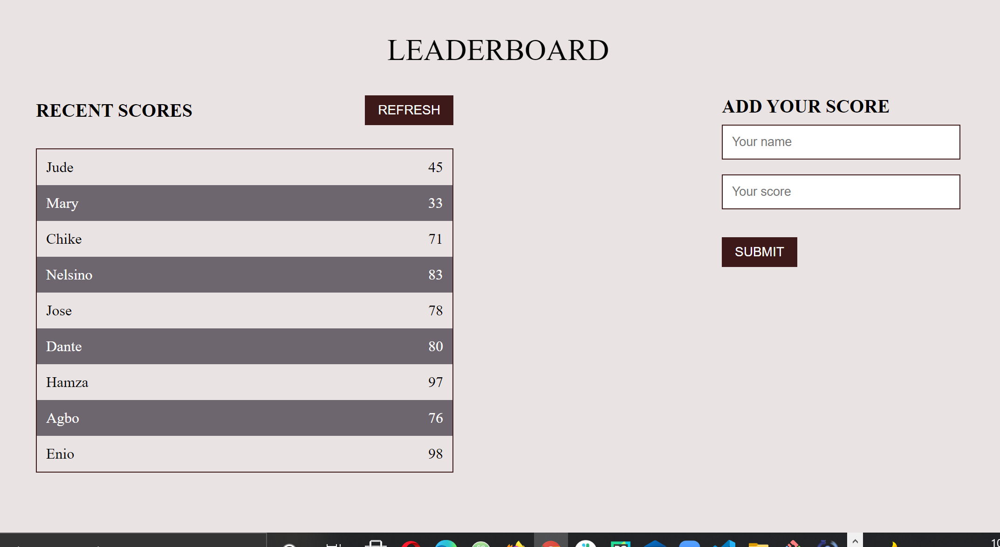

# LeaderBoard_Project

Leaderboard is a web application that allows users to play and display their game scores. It provides an interface for adding player name and score, for visualizing the list of scores for a collection of players. This is achieved using plain HTML, CSS, JavaScript, git flow, and webpack.

## Built With

- HTML
- CSS
- JavaScript
- Git flow
- GitHub
- web pack

### Prerequisites

- Terminal (Bash)
- Git
- JavaScript
  
### Setup: How to start the Todo_List app

- git clone the repo: `https://github.com/Chike1990/LeaderBoard_Project`
- cd into: `LeaderBoard_Project folder`
 - npm install
 - npm start
## Author
👤 Chibuike Uzoechina

- GitHub: [@Chike1990](https://github.com/Chike1990)
- Twitter: [@ChibuikeUzoechi](https://twitter.com/ChibuikeUzoechi)
- LinkedIn: [@Chibuike-Uzoechina](https://www.linkedin.com/in/chibuike-uzoechina-630857102)

## 🤝 Contributing

Contributions, issues, and feature requests are welcome!

Feel free to check the [issues page]

## Show your support

Give a ⭐️ if you like this project!

## Acknowledgments

- Many thanks to Microverse
- friends
- our standup team

## 📝 License

This project is [MIT](LICENSE) Licensed.
